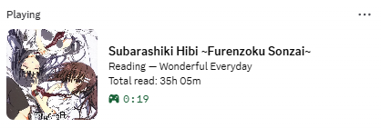
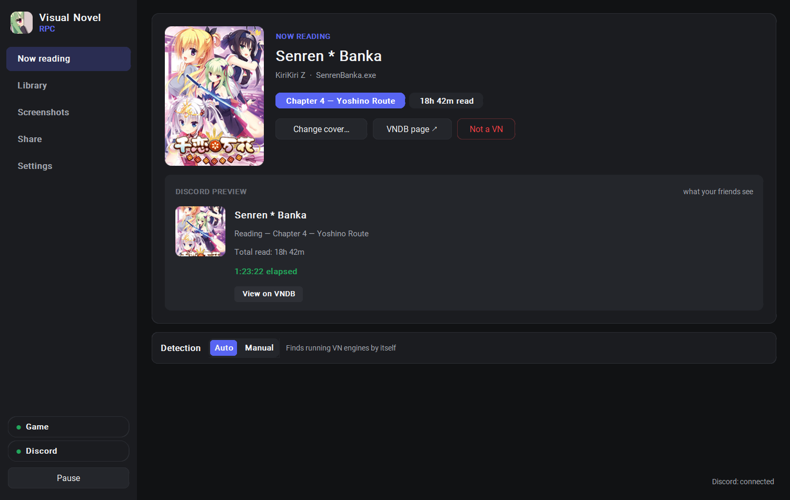
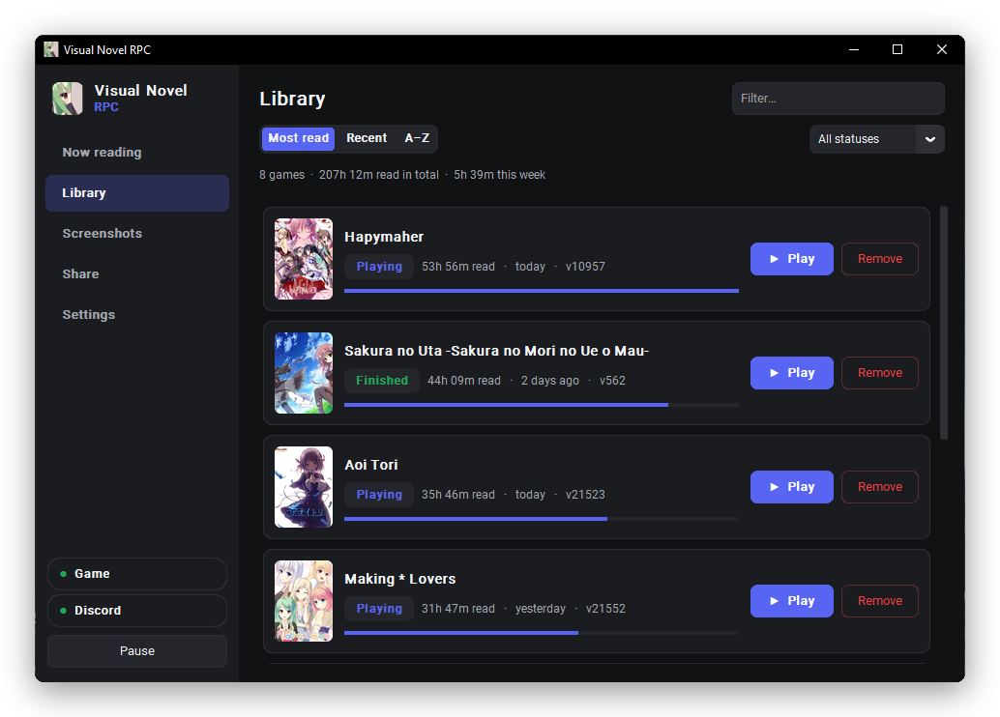
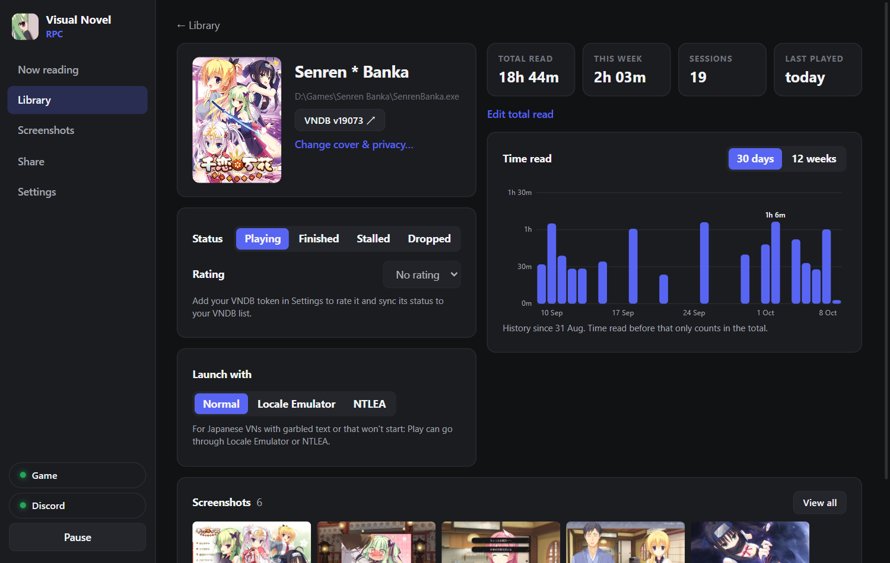
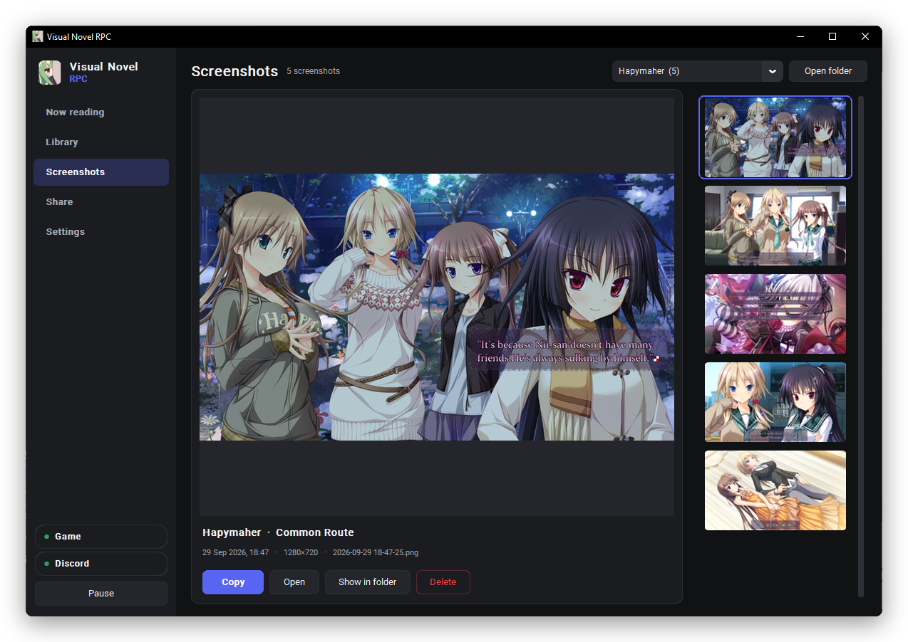
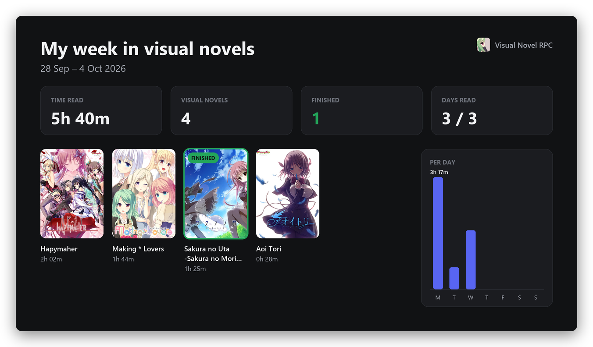
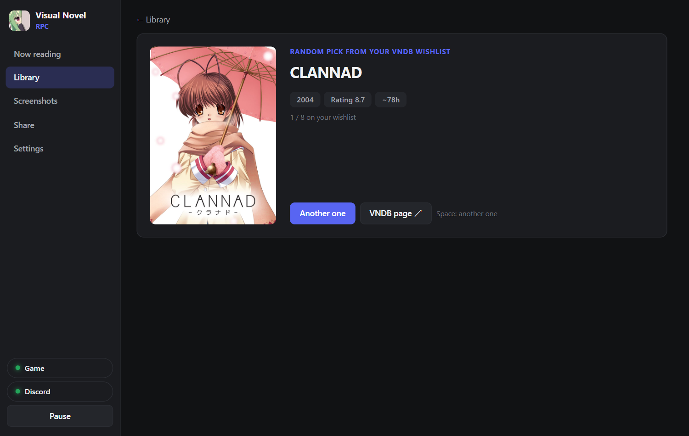
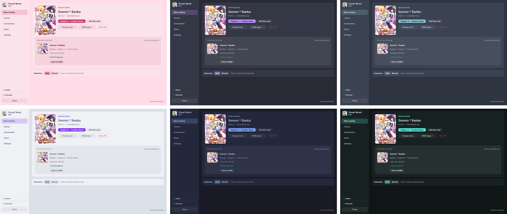
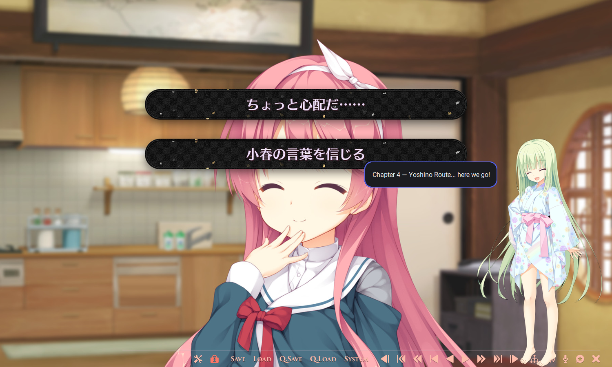

# Visual Novel RPC

Show the visual novel you're reading on your **Discord profile**: the game, your current chapter or route, the time read and its cover.

<p align="center"></p>

<p align="center">
  <a href="https://github.com/lennmoe/vnrpc/releases/latest"><b>Download</b></a> ·
  <a href="https://vnrpc-docs.vercel.app/"><b>Documentation</b></a> ·
  <a href="https://vnrpc-docs.vercel.app/troubleshooting/">Troubleshooting</a> ·
  <a href="https://discord.gg/2SUrBSYzbK">Discord</a>
</p>

A small Windows tray app, written in Rust with [Tauri](https://tauri.app). It reads the title of the VN's window, so most engines work without any setup. One light `.exe` (about 9 MB), nothing else to install.

## Features

- **Finds the VN by itself** (Ren'Py, KiriKiri, SiglusEngine, Unity…), or you pick the window by hand.
- **Shows where you are**: prologue, chapter, route or ending, read from the window title (English, French, Japanese).
- **Tracks time read** for each VN, with a day-by-day history. You can also set it by hand.
- **Covers** from VNDB, an image link or a file on your PC.
- **Privacy per game**: everything, no chapter, just "Visual Novel", or nothing. NSFW covers stay blurred and off Discord unless you allow them.
- **Library** of every VN you've read, with a page for each one: status, rating, reading chart, screenshots and a Play button.
- **Screenshots** of the game window with one key, sorted by VN, in a built-in gallery.
- **Share card**: "My week / my month in visual novels", copied as an image to paste on Discord.
- **VNDB list sync**, and a **random pick from your VNDB wishlist** when you can't decide what to read next.
- **Japanese locale**: start a VN through Locale Emulator or NTLEA from its Play button.
- **Themes**: Dark, Light, Sakura, Dracula, Nord, Catppuccin, Tokyo Night, Gruvbox, Rosé Pine, Solarized… or your own colors.
- **Desktop mascot** (optional, ukagaka style) who comments on what you read.
- **Idle mode**, **export / import** of your data, **launch at startup**, and **updates** in one click.

## Screenshots

**Now reading** — the VN being read, and exactly what your friends see on Discord. [Docs](https://vnrpc-docs.vercel.app/now-reading/)

<p align="center"></p>

**Library** — every VN you've read, and a page for each one with its reading history. [Docs](https://vnrpc-docs.vercel.app/library/)

<p align="center"></p>
<p align="center"></p>

**Screenshots** — one key in game; browse, copy or delete them in the gallery. [Docs](https://vnrpc-docs.vercel.app/screenshots/)

<p align="center"></p>

**Share card** — your week or month in visual novels, ready to paste on Discord. [Docs](https://vnrpc-docs.vercel.app/share/)

<p align="center"></p>

**Random pick** — can't decide? Draw a VN from your VNDB wishlist. [Docs](https://vnrpc-docs.vercel.app/vndb/)

<p align="center"></p>

**Themes** — pick one with a click, or make your own. [Docs](https://vnrpc-docs.vercel.app/themes/)

<p align="center"></p>

**Desktop mascot** — a character who stands on your desktop and talks about what you read. Bring your own PNG if you like. [Docs](https://vnrpc-docs.vercel.app/mascot/)

<p align="center"></p>

## Install

1. Download [`VisualNovelRPC.exe`](https://github.com/lennmoe/vnrpc/releases/latest) and run it.
2. Keep the Discord desktop app open, with **Settings → Activity Privacy → Share your detected activities** turned on.

The app updates itself: it checks for a new release when it starts and shows what changed after an update. Full guide: [Install](https://vnrpc-docs.vercel.app/install/).

Coming from 1.x (the Python version)? The update to 2.0 is offered in the app as usual. Your settings, Library, play times and covers are picked up on the first launch.

## Community

Questions, bug reports, suggestions, and soon translations of the app into more languages: join the **[Discord server](https://discord.gg/2SUrBSYzbK)**. You can also [open an issue](https://github.com/lennmoe/vnrpc/issues).

## Documentation

Everything is explained on **[vnrpc-docs.vercel.app](https://vnrpc-docs.vercel.app/)**:

- [Discord status & privacy](https://vnrpc-docs.vercel.app/discord-status/) and [chapters & routes](https://vnrpc-docs.vercel.app/chapters/)
- [Covers](https://vnrpc-docs.vercel.app/covers/), [Library](https://vnrpc-docs.vercel.app/library/), [Screenshots](https://vnrpc-docs.vercel.app/screenshots/), [Share card](https://vnrpc-docs.vercel.app/share/)
- [VNDB list & wishlist](https://vnrpc-docs.vercel.app/vndb/), [Japanese locale](https://vnrpc-docs.vercel.app/japanese-locale/), [Themes](https://vnrpc-docs.vercel.app/themes/), [Desktop mascot](https://vnrpc-docs.vercel.app/mascot/)
- [All settings](https://vnrpc-docs.vercel.app/settings/), [Your data & backups](https://vnrpc-docs.vercel.app/data/), [Troubleshooting](https://vnrpc-docs.vercel.app/troubleshooting/)

## Run from source

Needs [Rust](https://rustup.rs), the MSVC build tools and Node.js, on Windows 10 or 11 (WebView2 is already part of Windows).

```
npm install
npm run dev
```

Build the `.exe` (close the app first; the result is `src-tauri\target\release\vnrpc.exe`, published as `VisualNovelRPC.exe`):

```
npm run build
```

Tests and formatting:

```
cd src-tauri
cargo test
cargo fmt
cd ..
npx prettier --write "ui/**/*.{js,css,html}"
```

### Where things are

The engine is in Rust (`src-tauri/src`). The interface is plain HTML, CSS and JavaScript modules (`ui/`), with no build step.

| `src-tauri/src` | |
|---|---|
| `engine.rs`, `state.rs` | the loop: detection, reading time, idle mode, Discord |
| `engines.rs`, `title_parser.rs` | engine detection, title cleaning, chapter and route parsing |
| `config.rs`, `vndb.rs`, `vndb_list.rs`, `steam.rs` | Library files, VNDB search, covers, list, rating and wishlist |
| `discord.rs` | Rich Presence over Discord's IPC pipe |
| `screenshots.rs`, `capture.rs`, `hotkey.rs`, `sound.rs` | capture key, window capture, shutter sound |
| `mascot.rs`, `ui_windows.rs`, `tray.rs` | desktop mascot, speech balloon, toast, main window, tray |
| `launcher.rs`, `backup.rs`, `updater.rs`, `autostart.rs` | Play (Locale Emulator, NTLEA), export and import, updates, startup |
| `images.rs`, `clipboard.rs`, `shell.rs`, `winapi.rs` | thumbnails, clipboard, Explorer, Win32 |
| `commands/` | what the windows can call, by feature |

| `ui/js` | |
|---|---|
| `pages/` | one file per page: home, cover, library, game, wishlist, screenshots, share, settings, what's new |
| `components/` | chart, share card, theme tab, hotkey input, Play, release notes, update, Discord button |
| `popups/` | the mascot, its speech balloon, the screenshot toast |
| `app.js`, `router.js`, `store.js`, `ui.js` | startup, navigation, shared state, small widgets |

## Where your data is

Everything is in `%APPDATA%\moe.lenn.vnrpc-tauri\`: `config.yaml` (settings), `games\<title>.yaml` (one file per VN, safe to edit) and `cache\`. Screenshots go to `Pictures\Visual Novel RPC\<VN title>\` unless you pick another folder. See [Your data & backups](https://vnrpc-docs.vercel.app/data/).

The 1.x versions kept their data in `%APPDATA%\VisualNovelRPC\`. Version 2.0 copies it on its first launch and leaves the original folder untouched.

---

<sub>Covers and game screenshots in these images come from [VNDB](https://vndb.org) and belong to their publishers.</sub>
